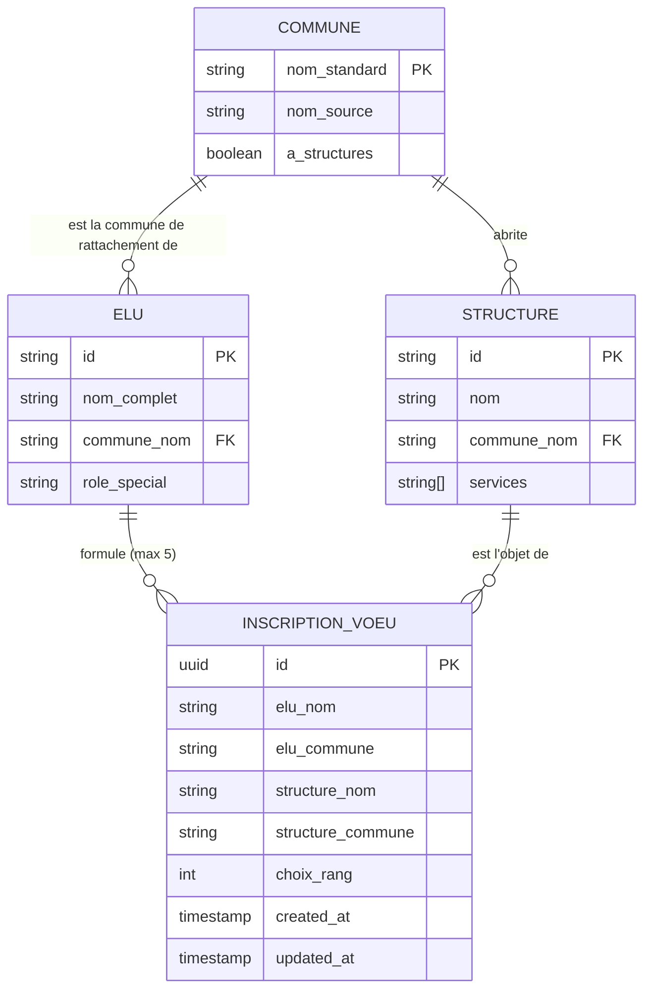

# Data Model: Inscription des élus aux structures Enfance-Jeunesse

**Feature**: `001-inscription-elus-commission`  
**Date**: 2026-09-04  
**Status**: Ready

---

## 1. Modèle Conceptuel de Données



---

## 2. Dictionnaire des Entités

### Entité : `COMMUNE`
Représente l'une des 14 communes membres représentées dans la commission.
- `nom_standard` (String, Clé primaire) : Nom officiel harmonisé (ex: `"Monistrol-sur-Loire"`, `"Bas-en-Basset"`).
- `nom_source` (String[]) : Liste des variantes trouvées dans les fichiers sources.
- `a_structures` (Boolean) : `true` si la commune dispose d'au moins une structure enfance-jeunesse, `false` sinon.

### Entité : `ELU`
Représente un membre élu de la commission Enfance Jeunesse Solidarités Prévention (32 élus communaux + 1 Présidente).
- `id` (String, Clé primaire) : Identifiant slug (ex: `"beau-virginie"`, `"brunel-nadege"`).
- `nom_complet` (String) : Nom et prénom de l'élu (ex: `"BEAU Virginie"`).
- `commune_nom` (String) : Nom standard de sa commune de rattachement.
- `role_special` (String, optionnel) : Titre particulier (ex: `"Présidente de la Communauté de communes"` pour Jocelyne DUPLAIN).

### Entité : `STRUCTURE`
Représente un équipement / établissement d'accueil du territoire (20 structures au total).
- `id` (String, Clé primaire) : Identifiant slug (ex: `"acija"`, `"mjc"`, `"le-beauvoir"`, `"echap-toi"`).
- `nom` (String) : Nom usuel (ex: `"Cap Evasion"`, `"Familles rurales - Arc en jeux"`).
- `commune_nom` (String) : Commune d'implantation.
- `services` (String[]) : Types d'accueil (ex: `["Crèche", "ALSH", "Ados"]`).

### Entité : `INSCRIPTION_VOEU`
Représente un vœu exprimé par un élu pour une structure.
- `id` (UUID, Clé primaire générée par la base Supabase).
- `elu_nom` (String, Obligatoire) : Nom complet de l'élu.
- `elu_commune` (String, Obligatoire) : Commune de l'élu.
- `structure_nom` (String, Obligatoire) : Nom de la structure retenue.
- `structure_commune` (String, Obligatoire) : Commune où est située la structure.
- `choix_rang` (Integer, Obligatoire, 1 à 5) : Ordre de préférence de l'élu.
- `created_at` (Timestamp ISO, Default `now()`).
- `updated_at` (Timestamp ISO, Default `now()`).

---

## 3. Règles de Validation Métier

1. **Règle d'incompatibilité communale** :
   - `INSCRIPTION_VOEU.structure_commune` NE DOIT JAMAIS être égale à `INSCRIPTION_VOEU.elu_commune`.
   - Condition de rejet : `normalizeCommune(elu_commune) === normalizeCommune(structure_commune)`.
2. **Plafond de vœux** :
   - Un élu ne peut pas avoir plus de 5 vœux enregistrés (`COUNT(vœux) <= 5`).
3. **Unicité du vœu élu-structure** :
   - Un élu ne peut pas sélectionner deux fois la même structure.
   - Contrainte SQL : `UNIQUE(elu_nom, structure_nom)`.
4. **Unicité des rangs par élu** :
   - Un élu ne peut avoir qu'un seul vœu au rang 1, un seul au rang 2, etc.
   - Contrainte SQL : `UNIQUE(elu_nom, choix_rang)`.
5. **Intégrité de réindexation** :
   - Lors de la suppression d'un choix de rang `R`, tous les vœux de l'élu ayant un rang `> R` sont décrémentés de 1.

---

## 4. Cycle de Vie d'un Vœu

```text
[Cellule non sélectionnée] 
       │
       ▼ (Clic 1, si non bloqué et rangs < 5)
[Vœu attribué : Choix N+1] ─── (Persisté dans Supabase)
       │
       ▼ (Clic 2 sur la même cellule)
[Vœu annulé] ─── (Supprimé de Supabase + Réindexation des rangs suivants)
```
